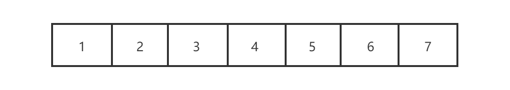
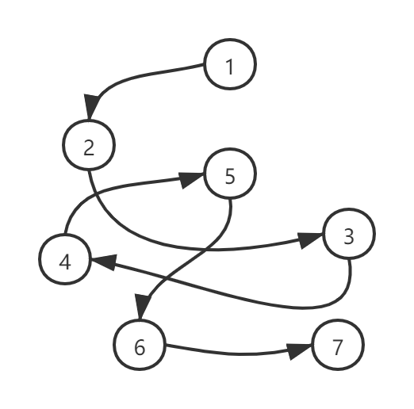

# 第1章 数据结构和算法概述

## 1.1 什么是数据结构

- **官方解释**：数据结构是一门研究非数值计算的程序设计问题中的操作对象，以及他们之间的关系和操作等相关问题的学科。

- **大白话**：数据结构就是把数据元素按照一定的关系组织起来的集合，用于组织和存储数据。

## 1.2 数据结构分类

传统上，我们可以把数据结构分为逻辑结构和物理结构两大类。

##### 1.2.1 逻辑结构分类

​	逻辑结构是从具体问题中抽象出来的模型，是抽象意义上的结构，按照对象中数据元素之间的相互关系分类。

- **线性结构**：线性结构中的数据元素之间存在一对一的关系。

- **树形结构**：树形结构中的数据元素之间存在一对多的关系。

- **图形结构**：图形结构的数据元素是多对多的关系。

- **集合结构**：集合结构中元素除了属于同一个集合外，他们之间没有任何其他关系。

##### 1.2.2 物理结构分类

​	逻辑结构在计算机中真正的表示方式（又称为映像）称为物理结构，也可以叫做存储结构。**常见**的物理结构有顺序存储结构和链式存储结构。

- **顺序存储结构**：把数据元素放到地址连续的存储单元里面，其数据间的逻辑关系和物理关系一致，比如数组就是顺序存储结构。

​	顺序存储结构存在一定的弊端，就像生活中排队时也有人插队也有人突然离开，这时候这个结构都处于变化中，此时就需要链式存储结构。

​	优点：存储密度大(=1),存储空间利用率高，可以实现随机存取。

​	缺点：插入或删除元素时不方便；只能使用相邻的的一整块存储单元，因此可能产生较多的外部碎片。

- **链式存储结构**：把数据元素存放在任意的存储单元里面，这组存储单元可以是连续的也可以是不连续的。此时，数据元素之间并不能反映元素间的逻辑关系，因此在链式存储结构中引进了一个指针存放数据元素的地址，这样通过地址就可以找到相关联数据元素的位置

​	优点：插入或删除元素时很方便，使用灵活。

​	缺点：存储密度小（<1），存储空间利用率低。

## 1.3 什么是算法

​	算法是指解题方案的准确而完整的描述，是一系列解决问题的清晰指令，算法代表着用系统的方法解决问题的策略机制。也就是说，能够对一定规范的输入，在有限时间内获得所要求的输出。

- 五个重要特性

  1）**有穷性**。一个算法（对任何合法的输入值）必须总是在执行有穷步之后结束，且每一步都可在有穷时间内完成。

  2）**确定性**。算法中每条指令必须有确切的含义，读者理解时不会产生二义性，即对于相同的输入只能得出相同的输出。

  3）**可行性**。一个算法是可行的，即算法中描述的操作都是可以通过已经实现的基本运算执行有限次来实现的。

  4）**输入**。一个算法有零个或多个输入，这些输入取自于摸个特定的对象的集合。

  5）**输出**。一个算法有一个或多个输出，这些输出是与输入有这某种特定关系的量。

- 优秀的算法应考虑

  1）正确性。算法应能够正确地解决求解问题。

  2）可读性。算法应具有良好的可读性，以帮助人们理解。

  3）健壮性。输入非法数据时，算法能适当地做出反应或进行处理，而不会产生莫名其妙的输出结果。

  4）效率与低存储量需求。效率是指算法执行的时间，存储量需求是指算法执行过程中所需要的最大存储空间，这两者都与问题的规模有关。